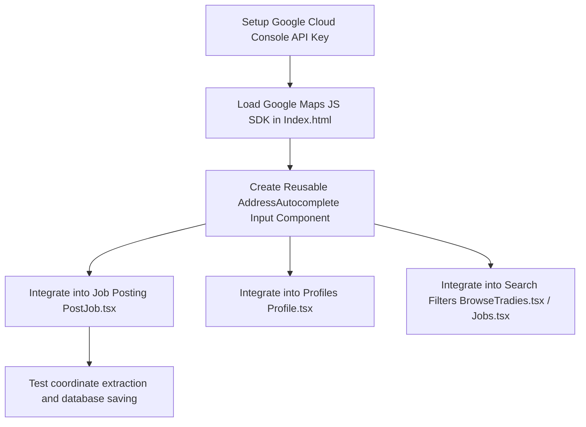

# Location / Address Autocomplete Integration Plan

This document outlines the proposed architecture and implementation plan for integrating Google Places Autocomplete into the TradieHubAU platform.

## 1. Objectives
* **Improve User Experience**: Eliminate manual select dropdowns for suburb/state selection on Job Posting, Search Filters, and Profile Setup.
* **Ensure Data Integrity**: Capture validated Australian addresses, ensuring correct postcode, suburb, region, state, and lat/long coordinates.
* **Keep Backwards Compatibility**: Support existing database columns (`suburb`, `state`, `postcode`, `region`) seamlessly.
* **Manage Costs**: Implement session tokens and debounce mechanisms to optimize Google Maps API billing.

---

## 2. Current Schema & Structure
Currently, locations are loaded statically from `frontend/src/lib/auLocations.ts` with structured filters:
* **State** (e.g., NSW, QLD, VIC)
* **Region** (e.g., Sydney, Greater Brisbane)
* **Suburb** (e.g., Surry Hills, Brisbane City)

Jobs table has:
* `suburb` (TEXT)
* `state` (TEXT)
* `postcode` (TEXT)
* `region` (TEXT)

---

## 3. Integration Architecture

### Frontend (Google Places Autocomplete Widget)
* **Loading Script**: Dynamically load the Google Maps JavaScript API with the `places` library enabled.
* **Component Integration**: Create a custom reusable `<AddressAutocomplete />` input component wrapper using standard Vanilla CSS styling matching the design system.
* **Session Tokens**: Generate a new `AutocompleteSessionToken` when the user starts typing and pass it with requests to group keystrokes into a single billing event.
* **Bounds Filtering**: Restrict autocomplete results strictly to Australian addresses (`components: 'country:au'`).

### Data Mapping Flow
When a user selects an address from the Autocomplete dropdown:
1. Fetch address details using the `getDetails` request (binding the session token).
2. Extract the address components:
   * `locality` $\rightarrow$ Map to `suburb`
   * `administrative_area_level_1` $\rightarrow$ Map to `state`
   * `postal_code` $\rightarrow$ Map to `postcode`
   * `geometry.location` $\rightarrow$ Map to lat/long coordinates for future map plotting.
3. Determine `region` programmatically using the suburb/postcode mapping or a custom utility.

---

## 4. Implementation Steps

### Phase 1: SDK & Configuration
1. Restrict Google API Key to web application domain HTTP referrers in GCP Console.
2. Enable **Maps JavaScript API** and **Places API**.

### Phase 2: React Component Setup
1. Define types and interfaces for autocomplete selections.
2. Implement input debounce (300ms) to reduce API request volume.
3. Group address parts into standard Australian format (e.g., "Unit 1, 10 Main St, Surry Hills NSW 2010").

### Phase 3: Integration and Testing
1. Update `PostJob.tsx` location input fields.
2. Update `Profile.tsx` address input fields.
3. Validate database insertions and verify RLS allows saving coordinates.
