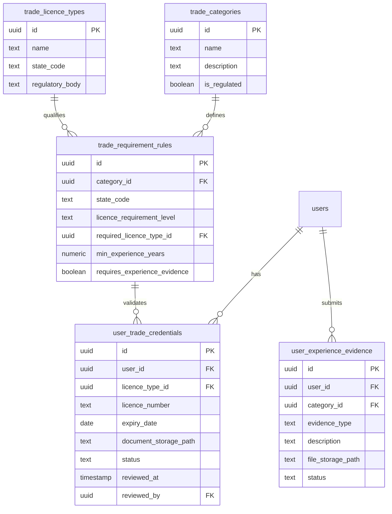

# Trade-Specific Verification Plan

*Disclaimer: This document is a design plan and framework for trade-specific verification on the TradieHubAU platform. Trade licensing regulations in Australia are determined by state and territory authorities. Requirements vary significantly by jurisdiction, licence class, and job scope. This plan should be reviewed by legal and compliance professionals prior to production enforcement.*

---

## 1. Current System Summary

The current verification system in TradieHubAU consists of two main pillars:
1.  **Identity Verification:** Photo ID (Drivers Licence, Passport, Proof of Age) and a Liveness Selfie.
2.  **Professional Tradie Approval:** Australian Business Number (ABN), Contractor Licence, and Public Liability Insurance.

### Database Tables, Fields & RPCs Involved:
*   `public.users`: Contains general profile fields (`role`, `verified`, `identity_verified`, `tradie_verified`, `abn`, `license_number`).
*   `public.verifications`: Stores uploaded documents (`id`, `user_id`, `document_type`, `status`, `expires_at`, `recheck_requested_at`, `recheck_reason`, `recheck_requested_by`).
    *   Allowed `document_type` values: `license`, `passport`, `contractor_license`, `insurance`, `other`, `drivers_license`, `proof_of_age`, `other_identity`, `liveness_selfie`.
    *   Allowed `status` values: `pending`, `approved`, `rejected`, `recheck`.
*   **Database Trigger:** `protect_user_fields()` checks that the client API cannot self-promote a role to `tradie` or set `verified`/`identity_verified`/`tradie_verified` to `true`.
*   **RPC functions:**
    *   `approve_identity_verification(v_id)`: Approves the ID verification record and updates the profile's `identity_verified = true`.
    *   `approve_tradie_profile(user_id)`: Whitelists a tradie profile, sets `tradie_verified = true`, and upgrades the role.
    *   `check_and_auto_whitelist_tradie(user_id)`: A validation RPC that whitelists a user once they have approved, unexpired ID, selfie, licence, and insurance records.
*   **Gating Policies:** The `applications` table has a Postgres RLS policy that blocks quotes/applications unless the authenticated `tradie_id` has `tradie_verified = true`.

### What to Preserve:
*   Keep the core separation between **Identity Verification** and **Tradie Professional Verification**.
*   Maintain the automatic whitelisting logic (`check_and_auto_whitelist_tradie`) but upgrade it so that the final step triggers trade-specific evaluation.
*   Retain administrative overriding functions to ensure support teams can force verification status changes.

---

## 2. Proposed Verification Model

We propose upgrading the verification flow from a single-tier professional check to a two-tier model: **Base Verification** (required for all tradies) + **Trade-Specific Verification** (triggered based on selected trades and location).

```
   [ Tradie Registration ]
             │
             ▼
┌──────────────────────────┐
│ Base Verification        │
│ ├─ Photo ID / Selfie     │
│ ├─ ABN Check             │
│ └─ Liability Insurance   │
└────────────┬─────────────┘
             │
             ▼
┌──────────────────────────┐
│ Trade-Specific Check     │
│ ├─ Select State/Territory│
│ ├─ Select Trade Category │
│ └─ Match Licence/Rules   │
└────────────┬─────────────┘
             │
             ▼
┌──────────────────────────┐
│ Quote/Application Gate   │
│ ├─ Customer Blocked      │
│ ├─ Regulated Trades Lock │
│ └─ General Work Free     │
└──────────────────────────┘
```

### Tier 1: Base Tradie Verification (Mandatory for all)
*   **Photo ID:** Passport or State Drivers Licence.
*   **Liveness Selfie:** Verification of identity presence.
*   **ABN:** Australian Business Number (verified active via ABN Lookup API).
*   **Public Liability Insurance:** Active policy document with min. $5M coverage.
*   **Trade Category Selection:** Initial selection of trade areas.
*   **Self-Reported Experience:** Years of trade experience and short text summary.

### Tier 2: Trade-Specific Verification (Triggered by Category and State)
*   **Location Select:** State or Territory (VIC, NSW, QLD, WA, SA, TAS, ACT, NT).
*   **Licence Required Check:** Set by category rule (Required, Conditional, Not Required).
*   **Licence/Registration Details:**
    *   Licence Class/Type (e.g. A-Grade Electrician, Licensed Plumber, Domestic Builder Limited).
    *   Licence Number.
    *   Expiry Date.
    *   State of Issue.
*   **Document Upload:** High-resolution photo/PDF of physical licence card.
*   **Supplemental Experience Evidence (Conditional):** Proof of qualifications, trade certificates (Certificate III/IV), apprenticeship completions, or employment references.

---

## 3. Trade Requirement Table Design

To support state-specific rules and multiple categories per tradie, we propose the following schema additions:



### Table 1: `public.trade_categories`
Stores the trade classifications.
```sql
CREATE TABLE public.trade_categories (
  id uuid PRIMARY KEY DEFAULT gen_random_uuid(),
  name text UNIQUE NOT NULL,
  description text,
  is_regulated boolean DEFAULT false NOT NULL,
  created_at timestamptz DEFAULT now() NOT NULL
);
```

### Table 2: `public.trade_licence_types`
Stores the valid licence types per state.
```sql
CREATE TABLE public.trade_licence_types (
  id uuid PRIMARY KEY DEFAULT gen_random_uuid(),
  name text NOT NULL,
  state_code varchar(3) NOT NULL, -- VIC, NSW, QLD, etc.
  regulatory_body text NOT NULL, -- e.g., EnergySafe Victoria, QBCC, Fair Trading
  created_at timestamptz DEFAULT now() NOT NULL,
  UNIQUE(name, state_code)
);
```

### Table 3: `public.trade_requirement_rules`
Defines what licence and experience parameters apply to a trade in a specific state.
```sql
CREATE TABLE public.trade_requirement_rules (
  id uuid PRIMARY KEY DEFAULT gen_random_uuid(),
  category_id uuid REFERENCES public.trade_categories(id) ON DELETE CASCADE,
  state_code varchar(3) NOT NULL,
  licence_requirement_level text NOT NULL, -- 'required', 'conditional', 'usually_not_required'
  required_licence_type_id uuid REFERENCES public.trade_licence_types(id) ON DELETE SET NULL,
  min_experience_years numeric DEFAULT 0 NOT NULL,
  requires_experience_evidence boolean DEFAULT false NOT NULL,
  created_at timestamptz DEFAULT now() NOT NULL,
  UNIQUE(category_id, state_code)
);
```

### Table 4: `public.user_trade_credentials`
Stores the tradie's submitted licences.
```sql
CREATE TABLE public.user_trade_credentials (
  id uuid PRIMARY KEY DEFAULT gen_random_uuid(),
  user_id uuid REFERENCES public.users(id) ON DELETE CASCADE NOT NULL,
  licence_type_id uuid REFERENCES public.trade_licence_types(id) NOT NULL,
  licence_number text NOT NULL,
  expiry_date date NOT NULL,
  document_storage_path text NOT NULL, -- secure bucket path
  status text DEFAULT 'pending' NOT NULL, -- 'pending', 'approved', 'rejected', 'recheck'
  recheck_reason text,
  reviewed_at timestamptz,
  reviewed_by uuid REFERENCES public.users(id),
  created_at timestamptz DEFAULT now() NOT NULL
);
```

### Table 5: `public.user_experience_evidence`
Stores supplemental proof of experience (apprenticeships, references, certs).
```sql
CREATE TABLE public.user_experience_evidence (
  id uuid PRIMARY KEY DEFAULT gen_random_uuid(),
  user_id uuid REFERENCES public.users(id) ON DELETE CASCADE NOT NULL,
  category_id uuid REFERENCES public.trade_categories(id) NOT NULL,
  evidence_type text NOT NULL, -- 'certificate', 'referee_letter', 'completion_log'
  description text,
  file_storage_path text NOT NULL, -- secure bucket path
  status text DEFAULT 'pending' NOT NULL, -- 'pending', 'approved', 'rejected'
  created_at timestamptz DEFAULT now() NOT NULL
);
```

---

## 4. Suggested Trade Matrix

This matrix acts as a starter framework. Note: **Licence rules vary by state/territory, licence class, and job scope.**

| Trade | Licence Level | Must-Have Licence / Registration Fields | Useful but Not Mandatory Proof | Experience Proof Options | Risk Level | Notes / Warnings |
| :--- | :--- | :--- | :--- | :--- | :--- | :--- |
| **Electrician** | Required | Electrical Worker Licence, Licence Number, State, Expiry | Trade Certificate (Cert III) | Apprenticeship log, employer reference | Restricted | High risk. Work is strictly regulated by state bodies (e.g. ESV, NSW Fair Trading). |
| **Electrical Contractor** | Required | Registered Electrical Contractor (REC) / Contractor Licence | Public liability insurance, business details | REC course completion, past company registration | Restricted | Must verify business entity registration in addition to individual worker licence. |
| **Plumber** | Required | Plumbing Licence (state registered/licensed classes) | Certificate III in Plumbing | Referee letters, past plumbing projects | Restricted | Sanitary, water supply, and drainage work requires licensed practitioners. |
| **Gasfitter** | Required | Gasfitting Licence or licensed endorsement | Gas safety certifications | Training logs, gas company certs | Restricted | Gas installations are high risk. Often structured as a plumbing licence endorsement. |
| **Roof Plumber** | Required | Roof Plumbing licence class/registration | Working at Heights certificate | Safety certificates, employer logs | High | High risk due to heights and structural water leakage liabilities. |
| **Builder** | Required | Registered Builder (Domestic/Commercial class) | Project history portfolios | Reference letters, building diplomas | Restricted | State-regulated caps on structural work value apply. Structural work requires licence. |
| **Carpenter** | Conditional | Carpentry Contractor Licence (Required in NSW/QLD above thresholds) | Cert III in Carpentry | Logbooks, apprentice verification | Medium | Often unregulated for minor tasks, but licensed for structural residential building. |
| **Painter** | Conditional | Painting Contractor Licence (Required in NSW/QLD/WA above value limits) | Cert III in Painting/Decorating | Business registration, past projects | Medium | Value thresholds apply (e.g. NSW projects over $5k require licensing). |
| **Tiler** | Conditional | Wall and Floor Tiling Licence (Required in NSW/QLD/SA above value limits) | Waterproofing endorsement | Past project portfolio, training certs | Medium | Licensing required for major renovation and structural tiling projects. |
| **Waterproofer** | Required | Waterproofing Licence (Required in NSW/QLD) | Waterproofing Certificate (Cert III) | Manufacturer product training certs | High | High liability trade. Improper waterproofing causes major structural damage. |
| **Concreter** | Conditional | Concreting Licence (NSW/QLD above value limits) | Cert III in Concreting | Project photographs, contractor references | Medium | Structural slabs and driveways require licenced/registered contractors. |
| **Landscaper** | Conditional | Structural Landscaping licence class (NSW/QLD/SA) | Horticulture diplomas | Landscape design portfolio | Medium | General garden care does not require licensing; structural landscape walls do. |
| **HVAC / Refrigeration** | Required | Refrigerant Handling Licence (ARC Tick) + Trade licence | Electrical/Plumbing licence copies | ARC certification logs | Restricted | Regulated by Australian Refrigeration Council (ARC) and state safety bodies. |
| **Pest Control** | Required | Pest Control Operator Licence (State Health Dept) | Chemical handling accreditation | Course completions, chemical logs | High | High risk due to chemical usage and termite structural damage liabilities. |
| **Asbestos Removal** | Required | Asbestos Removal Licence (Class A / Class B) | SafeWork / WorkSafe notifications | Medical clearance certificates, logs | Restricted | Class A required for friable asbestos; Class B for non-friable. Extremely restricted. |
| **Demolition** | Required | Demolition Licence (Class 1 / Class 2) | Structural engineering references | Demolition logs, safety planner | Restricted | High risk. Requires WorkSafe approvals and specific safety equipment. |
| **Handyman / General** | Usually not required | None (Must state project value limitations) | General safety cards (White Card) | Handyman portfolios, reference letters | Low | **Must be gated from structural, electrical, plumbing, or asbestos removal work.** |
| **Cleaner / Pressure Wash**| Usually not required | None | Commercial cleaning certificates | Testimonials | Low | Minor chemical risk. High-pressure washing must protect structural surfaces. |
| **Gardener / Lawn Mower** | Usually not required | None | Horticulture certifications | Client testimonials | Low | Lawn mowing and garden care. Must be blocked from structural arborist work. |
| **Arborist / Tree Work** | Conditional | Arboriculture Licence (Required for climbing/removal in some councils) | Cert III/IV/Diploma in Arboriculture | Climbing certifications, safety records | High | High risk heights and falling hazard. Liability insurance levels must be verified. |
| **Solar Installer** | Required | Clean Energy Council (CEC) accreditation + Elec Licence | CEC design/install credentials | Grid connection logs, training certs | Restricted | Regulated by the Clean Energy Regulator. Requires A-grade electrical registration. |
| **Security / Locksmith** | Required | Security Industry Licence (State Police) / Locksmith Registration | Locksmith apprenticeship certs | Police checks, locksmith association certs | Restricted | Highly regulated for security. Operates under state security licensing acts. |

---

## 5. Admin Workflow Design

Administration staff will verify credentials using the admin dashboard:

1.  **Overview Review Queue:** Admin is presented with a queue of pending verifications sorted by submission date.
2.  **Identity Verification step:**
    *   Compare the user's submitted Driver Licence/Passport name against the register profile.
    *   Verify the liveness selfie matches the ID document.
3.  **ABN Check:**
    *   Confirm ABN matches business details and is currently active.
4.  **Licence Details validation:**
    *   Compare Licence state, number, class, and expiry with the physical document image.
    *   Cross-reference state databases (e.g., EMR, QBCC portal, NSW Service Portal) to verify licence validity.
5.  **Experience Evidence verification:**
    *   Confirm qualifications, check referee contact details, or review work logs.
6.  **Approval / Rejection Action:**
    *   **Approve:** Set status to `approved`, update state timestamps, and unlock quoting.
    *   **Reject:** Set status to `rejected`, log a rejection reason, and notify the user.
    *   **Recheck:** For close expiries or minor updates, flag for recheck, log reasons, and allow limited bidding.

---

## 6. User Profile Workflow Design

The user interaction model for verification:

1.  **Trade Selection:** Users select their trade categories on their profile.
2.  **State Selection:** Users select their primary state of service.
3.  **Dynamic Guidelines:** The interface dynamically queries `trade_requirement_rules` and lists required licences and credentials based on selected trades and location.
4.  **Upload Portal:** A form is rendered to input licence number, expiry, state, and upload files.
5.  **State Tracking:** Indicators display verification progress (`pending`, `approved`, `recheck required`).
6.  **Gating Information:** Clear banners explain that quoting on restricted categories remains locked until admin review is complete.

---

## 7. Quote / Application Gating Design

To ensure customer and platform safety:

1.  **Role Gating:** Customers are blocked from quoting at the route and API level.
2.  **Base Gating:** Tradies must have `identity_verified = true` and `tradie_verified = true` to send standard quotes.
3.  **Category Gating:**
    *   For **Restricted/Required** categories (e.g. Electrical, Plumbing, Solar), the system checks if the user has an approved `user_trade_credentials` record corresponding to the required category.
    *   If no active, approved licence is linked, the "Submit Quote" button is disabled and displays: *"Licence verification required for this trade category."*
4.  **Handyman Gating:** Users registered under "Handyman/General Maintenance" are prevented from bidding on any job categorised as "Electrical", "Plumbing", "Gasfitting", "Solar", "Pest Control", "Asbestos Removal", or "Demolition".

---

## 8. Public Display / Privacy Design

To build trust while protecting private documents and contact information:

### Public-Safe Badges:
*   `[ID Checked]` (Identity matches registered details).
*   `[Insurance Checked]` (Public liability insurance active).
*   `[Licensed Trade Verified]` (Active licence verified for the trade).
*   `[Licence Verified for VIC]` (Indicates the state where the tradie is licensed).
*   `[Experience Verified]` (Years of experience evidence checked).

### Strictly Redacted Information (Hidden from Public Profile):
*   No physical licence upload document URLs.
*   No passport or personal ID card file downloads.
*   No insurance policy document downloads.
*   No private admin-review logs or risk scores.
*   No private phone/email details (locked until quote acceptance and payment funding).

---

## 9. Phased Implementation Plan

### Phase 1: Database Foundation
*   **Description:** Create schema migrations for categories, requirement rules, licence types, user trade credentials, and experience tables.
*   **Files changed:** New migration file in `supabase/migrations/`.
*   **Migration needed:** Yes.
*   **Risks:** Complex foreign key mapping.
*   **Manual QA:** Verify that migrations run cleanly on local postgres instance.
*   **Live SQL required:** No.

### Phase 2: Profile Verification UI
*   **Description:** Update the profile settings tab in the frontend to dynamically query requirement rules and allow licence inputs/uploads.
*   **Files changed:** `frontend/src/pages/Profile.tsx`.
*   **Migration needed:** No.
*   **Risks:** UI layout complexity with multiple uploads.
*   **Manual QA:** Verify that tradies can upload credentials and state transitions render correctly.
*   **Live SQL required:** No.

### Phase 3: Admin Review Dashboard
*   **Description:** Create the admin verification panel to let review staff inspect licences, check state databases, and trigger approvals.
*   **Files changed:** `frontend/src/pages/Admin.tsx`.
*   **Migration needed:** No.
*   **Risks:** Admin interface crowding due to multiple verification types.
*   **Manual QA:** Verify that clicking approve updates `user_trade_credentials` and triggers whitelisting.
*   **Live SQL required:** No.

### Phase 4: Quoting Gating
*   **Description:** Enforce trade-specific checks in the quoting flow, blocking applications on regulated jobs if trade credentials are not approved.
*   **Files changed:** `frontend/src/pages/Jobs.tsx`, `frontend/src/lib/payments.ts`.
*   **Migration needed:** Yes (to update application RLS policies to check category credentials).
*   **Risks:** Accidental locking of verified tradies from general work.
*   **Manual QA:** Test quoting as unverified tradie on electrical job vs painting job.
*   **Live SQL required:** No.

### Phase 5: Public Trust Badges
*   **Description:** Render safe badges on public tradie profiles without leaking private documents.
*   **Files changed:** `frontend/src/pages/PublicTradieProfile.tsx`.
*   **Migration needed:** No.
*   **Risks:** Slow loading due to relation queries.
*   **Manual QA:** Inspect profile view and ensure document links are not leaked.
*   **Live SQL required:** No.

### Phase 6: Expiry & Automation
*   **Description:** Set up automated system notifications when a licence is 30 days from expiry, and auto-revoke quote capabilities upon expiry.
*   **Files changed:** Edge functions, scheduler.
*   **Migration needed:** Yes (for cron trigger setup).
*   **Risks:** Incorrect revoking due to timezone mismatches.
*   **Manual QA:** Set an expiry to yesterday and verify quoting locks.
*   **Live SQL required:** No.

### Phase 7: Verification Rule Seed Data
*   **Description:** Populate rules and licence types for all states for the initial starter trades.
*   **Files changed:** Seed migration file.
*   **Migration needed:** Yes.
*   **Risks:** Incorrect licensing authority names.
*   **Manual QA:** Verify category rules exist.
*   **Live SQL required:** No.

### Phase 8: Security Audit & Policy Check
*   **Description:** Auditing bucket security and RLS policies on verifications.
*   **Files changed:** Audit check docs.
*   **Migration needed:** No.
*   **Risks:** Storage leaks.
*   **Manual QA:** Run storage policy penetration tests.
*   **Live SQL required:** No.

---

## 10. Beta-Safe Recommendation

For the initial TradieHubAU Beta, we recommend the following cautious approach:
1.  **Manual Admin Reviews:** Avoid developing automated licence scraping initially. Keep reviews manual using external state portals.
2.  **Soft-Warning Gating:** Instead of strictly blocking quoting initially, show a prominent warning in the quote flow: *"You are quoting on a regulated trade. Please ensure your active licence is uploaded. Unverified quotes may be flagged by admins."*
3.  **Hard-Enforce Only Top 3 Trades:** Strictly lock quoting for **Electricians, Plumbers, and Asbestos Removal** tradies. Keep other trades advisory.
4.  **Disclaimers:** Add visible disclaimers in the frontend: *"TradieHubAU validates licences for platform trust, but final compliance responsibilities remain with the service provider."*

---

## 11. Due Diligence & Platform Liability Limits

To maintain a secure and legally cautious system while keeping platform trust verification high, both customers and contractors are bound by clear due diligence rules:

### A. Customer Responsibilities
* **Review & Verification:** Customers are responsible for reviewing tradie profiles, badges, reviews, quote breakdowns, and uploaded completion evidence before accepting work or releasing payments.
* **Licence & Insurance Suitability:** Customers must check that the tradie possesses the correct active licence, registration, and insurance for the specific location, state/territory, job value, and work scope. Requirements vary by state, licence class, and job scope.
* **Payment Approval:** Customers should only approve work and release secure job payments when they are fully satisfied with the finished job outcome. Raised disputes must be logged prior to final approval.

### B. Contractor (Tradie) Responsibilities
* **Regulatory Compliance:** Tradies remain responsible for ensuring they hold the correct current licences, insurances, qualifications, and experience for the exact work they quote or accept.
* **No Category Bypasses:** Tradies must keep their credentials up to date and are strictly prohibited from using handyman or general maintenance categories to perform regulated or restricted trades.
* **Scope Verification:** Tradies must check job scopes, locations, site conditions, permit rules, and safety regulations prior to submitting quotations.

### C. Legal Status & Platform Disclaimer
* Platform checks (ID checked, licensed trade verified, insurance reviewed) support trust ratings but do not replace user due diligence or constitute formal legal, building, tax, or insurance advice.
* Verification badges indicate successful submission and review status on the platform, not a legal guarantee of capacity to perform all job variations.
